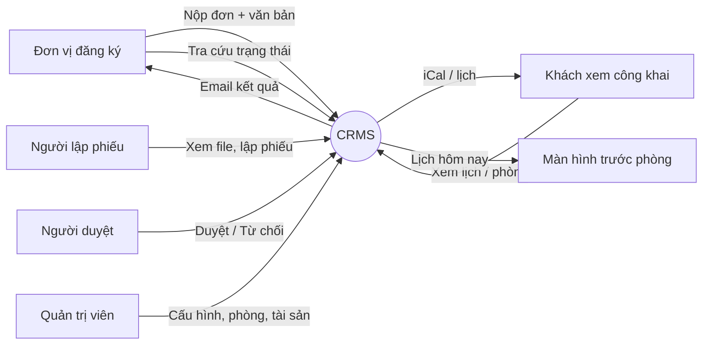
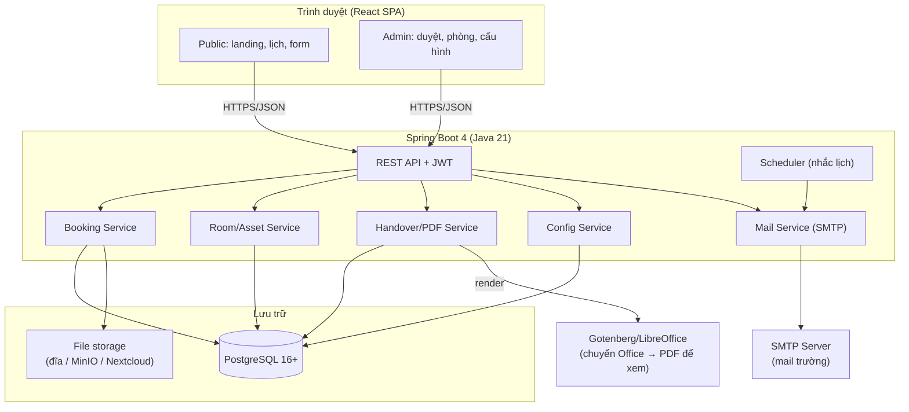
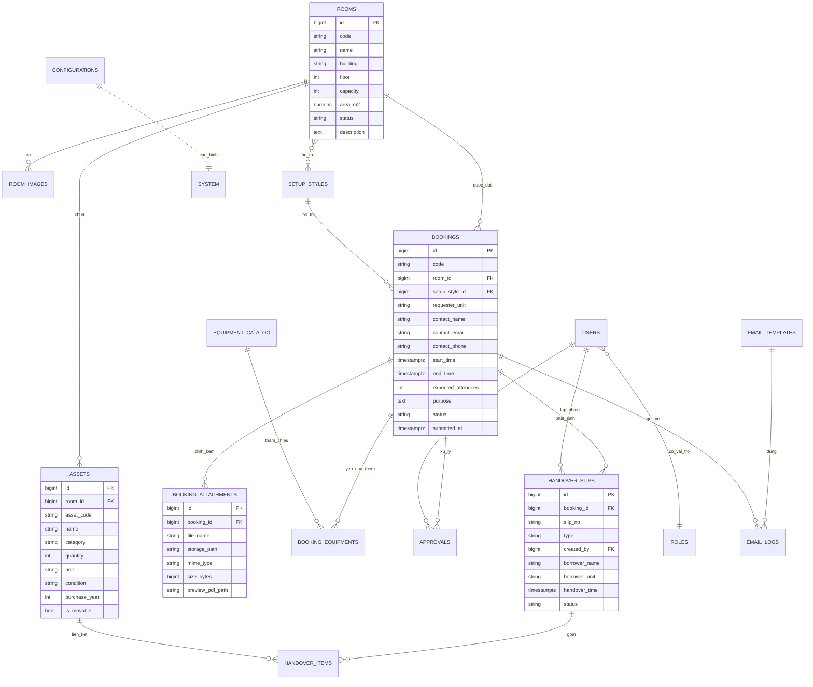
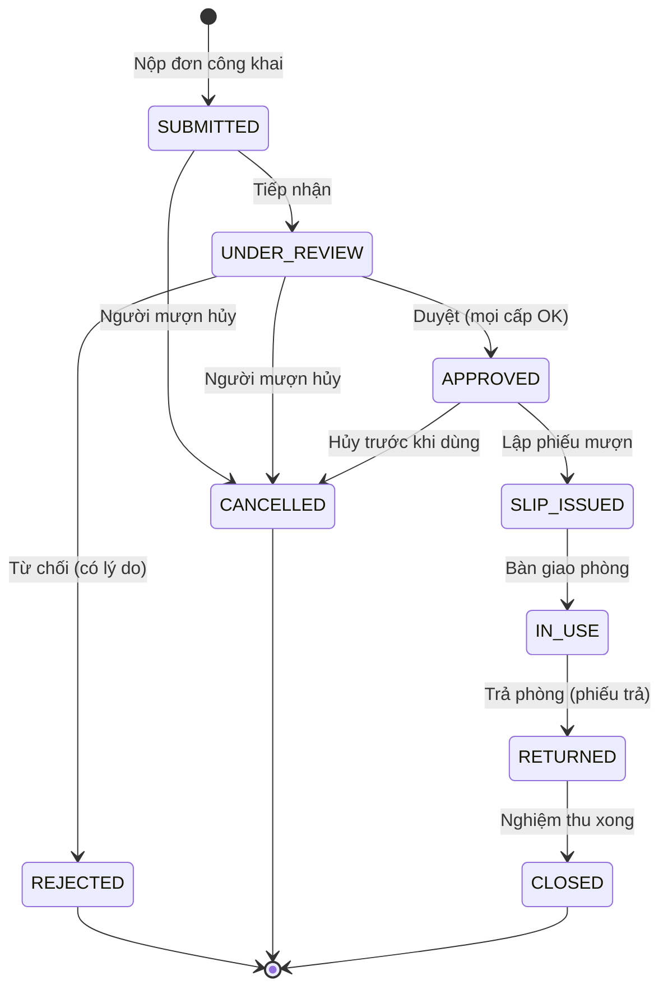
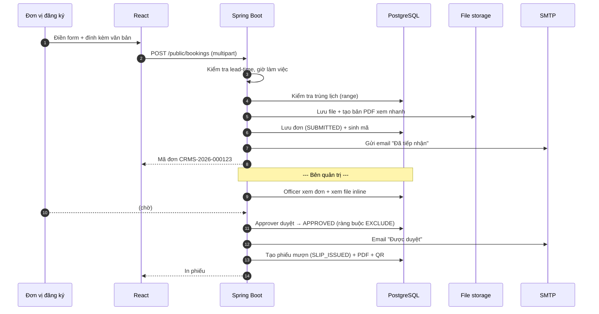
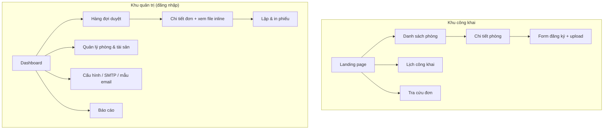

# ĐẶC TẢ PHẦN MỀM
# Hệ thống Quản lý Phòng — Trung tâm Hội nghị Trường Đại học Kiên Giang
### Conference Room Management System (CRMS)

| | |
|---|---|
| **Mã dự án** | CRMS-KGU |
| **Đơn vị chủ quản** | Phòng Quản trị Cơ sở Vật chất — Trường Đại học Kiên Giang |
| **Phạm vi vận hành** | Trung tâm Hội nghị (tòa nhà 11 tầng, tầng 5 & tầng 6) |
| **Công nghệ** | Spring Boot 4.x (Java 21 LTS) · React 18/19 · PostgreSQL 16+ |
| **Phiên bản tài liệu** | 1.0 (bản đặc tả khởi tạo) |
| **Ngày** | 22/09/2026 |

> **Ghi chú về "Spring Boot 21":** Không có Spring Boot phiên bản 21 — con số 21 ở đây là **Java 21 (LTS)**. Tài liệu này chọn **Spring Boot 4.x chạy trên Java 21**, đồng nhất với đề tài quản lý tài sản công bạn đang làm, để tái sử dụng kinh nghiệm và thư viện.

---

## MỤC LỤC

1. [Tổng quan & mục tiêu](#1-tổng-quan--mục-tiêu)
2. [Tác nhân & vai trò](#2-tác-nhân--vai-trò)
3. [Yêu cầu chức năng](#3-yêu-cầu-chức-năng)
4. [Yêu cầu phi chức năng](#4-yêu-cầu-phi-chức-năng)
5. [Kiến trúc hệ thống](#5-kiến-trúc-hệ-thống)
6. [Vì sao chọn PostgreSQL](#6-vì-sao-chọn-postgresql)
7. [Thiết kế cơ sở dữ liệu (ERD + bảng)](#7-thiết-kế-cơ-sở-dữ-liệu)
8. [Luồng nghiệp vụ & vòng đời đơn](#8-luồng-nghiệp-vụ--vòng-đời-đơn)
9. [Thiết kế API](#9-thiết-kế-api)
10. [Cấu hình hệ thống](#10-cấu-hình-hệ-thống)
11. [Xem nhanh file đính kèm (không tải về)](#11-xem-nhanh-file-đính-kèm)
12. [Email SMTP & mẫu thông báo](#12-email-smtp--mẫu-thông-báo)
13. [Phiếu mượn / trả phòng](#13-phiếu-mượn--trả-phòng)
14. [Giao diện & sơ đồ màn hình](#14-giao-diện--sơ-đồ-màn-hình)
15. [Bảo mật & phân quyền](#15-bảo-mật--phân-quyền)
16. [Đề xuất tính năng nên thêm](#16-đề-xuất-tính-năng-nên-thêm)
17. [Lộ trình triển khai (phân kỳ)](#17-lộ-trình-triển-khai)
18. [Phụ lục: danh sách phòng thực tế của KGU](#18-phụ-lục-danh-sách-phòng-thực-tế)

---

## 1. Tổng quan & mục tiêu

### 1.1. Bối cảnh
Trung tâm Hội nghị KGU có nhiều phòng hội thảo/họp với sức chứa và trang thiết bị khác nhau. Hiện việc mượn phòng thường xử lý thủ công (điện thoại, giấy tờ, hỏi trực tiếp), dễ trùng lịch, khó tra cứu, khó thống kê và không công khai được lịch cho các đơn vị.

### 1.2. Mục tiêu
- **Một cổng công khai** cho mọi đơn vị đăng ký mượn phòng trực tuyến, kèm văn bản đính kèm.
- **Duyệt tập trung** trên trang quản trị, xem nhanh văn bản mà không cần tải về, phản hồi kết quả qua email tự động.
- **In phiếu mượn/trả** chuẩn hóa, có người lập phiếu, người mượn và danh sách cơ sở vật chất (CSVC) của phòng.
- **Quản lý phòng & tài sản trong phòng**: mỗi phòng gắn danh mục trang thiết bị để phục vụ bàn giao và kiểm kê.
- **Lịch công khai** để các đơn vị bên ngoài xem tình trạng phòng theo thời gian thực.
- **Cấu hình linh hoạt**: thời gian đăng ký tối thiểu, giờ làm việc, loại nhu cầu, sức chứa, SMTP, mẫu email…
- **Chống trùng lịch tuyệt đối** ở tầng cơ sở dữ liệu (không phụ thuộc thao tác người dùng).

### 1.3. Phạm vi (in-scope)
Đăng ký công khai · duyệt/từ chối · phiếu mượn-trả · quản lý phòng & tài sản · lịch nội bộ + công khai · cấu hình · email · báo cáo thống kê cơ bản · nhật ký kiểm toán.

### 1.4. Ngoài phạm vi giai đoạn đầu (out-of-scope)
Thu phí dịch vụ · tích hợp sâu cổng thanh toán · ứng dụng di động native (dùng web responsive) · quản lý nhân sự phục vụ sự kiện (có thể mở rộng phase sau).

---

## 2. Tác nhân & vai trò

| Tác nhân | Đăng nhập? | Mô tả |
|---|---|---|
| **Đơn vị đăng ký (Requester)** | Không bắt buộc | Người/đơn vị nộp đơn mượn phòng qua trang công khai; tra cứu trạng thái bằng mã đơn + email. |
| **Người tiếp nhận / lập phiếu (Officer)** | Có | Chuyên viên Phòng QTCSVC: kiểm tra đơn, xem văn bản, lập phiếu mượn/trả. |
| **Người duyệt (Approver)** | Có | Lãnh đạo/được ủy quyền: duyệt hoặc từ chối (có thể nhiều cấp). |
| **Quản trị viên (Admin)** | Có | Cấu hình hệ thống, quản lý phòng/tài sản/người dùng, mẫu email, SMTP. |
| **Khách xem công khai (Public viewer)** | Không | Xem landing page, danh sách phòng, lịch công khai. |
| **Màn hình hiển thị (Signage – tùy chọn)** | Không (token) | TV đặt trước cửa phòng, hiển thị lịch phòng hôm nay. |



---

## 3. Yêu cầu chức năng

### 3.1. Trang công khai (Public Portal)
- **F-PUB-01** Landing page giới thiệu Trung tâm Hội nghị: hình ảnh, giới thiệu, danh sách phòng nổi bật, nút "Đăng ký mượn phòng", nút "Xem lịch".
- **F-PUB-02** Danh sách phòng: lọc theo tầng/sức chứa/thiết bị; mỗi phòng có ảnh, sức chứa, kiểu bố trí hỗ trợ, thiết bị sẵn có, mô tả.
- **F-PUB-03** Lịch công khai: xem theo tháng/tuần/ngày và theo từng phòng; trạng thái "Đã duyệt / Chờ duyệt (mờ) / Trống".
- **F-PUB-04** Form đăng ký mượn phòng (chi tiết ở 3.2).
- **F-PUB-05** Tra cứu trạng thái đơn bằng **mã đơn + email** (không cần tài khoản).
- **F-PUB-06** Xuất/đăng ký lịch iCal (subscribe) cho đơn vị ngoài.

### 3.2. Đăng ký mượn phòng (Booking Request)
- **F-BOOK-01** Thông tin người/đơn vị mượn: tên đơn vị, người liên hệ, email, số điện thoại.
- **F-BOOK-02** Chọn phòng, thời gian bắt đầu – kết thúc; số người dự kiến; kiểu bố trí (rạp hát, lớp học, chữ U, bàn tròn…).
- **F-BOOK-03** **Nhu cầu / thiết bị cần thêm**: chọn từ danh mục cấu hình (máy chiếu di động, mic không dây, nước uống, bảng tên, trực tuyến Zoom…) + số lượng + ghi chú.
- **F-BOOK-04** **Upload văn bản đính kèm**: đơn đề nghị mượn phòng, kế hoạch cấp trường… (PDF / DOC / DOCX / ảnh). Cho phép nhiều file, có giới hạn dung lượng/định dạng (cấu hình được).
- **F-BOOK-05** **Ràng buộc thời gian tối thiểu**: hệ thống chặn đăng ký nếu thời điểm bắt đầu cách hiện tại nhỏ hơn "thời gian đăng ký tối thiểu" (cấu hình được, ví dụ 48 giờ).
- **F-BOOK-06** **Kiểm tra trùng lịch tức thời**: nếu khoảng thời gian trùng đơn đã duyệt của phòng → cảnh báo và (tùy cấu hình) chặn nộp hoặc cho vào danh sách chờ.
- **F-BOOK-07** Checkbox đồng ý nội quy sử dụng phòng.
- **F-BOOK-08** Sinh **mã đơn** (VD `CRMS-2026-000123`), gửi email xác nhận đã tiếp nhận.
- **F-BOOK-09** (Tùy chọn) reCAPTCHA / hCaptcha chống spam trên form công khai.

### 3.3. Duyệt & xử lý (Admin – Approval)
- **F-ADM-01** Danh sách đơn theo trạng thái (Chờ duyệt / Đã duyệt / Từ chối / Đã hủy), lọc theo phòng, đơn vị, khoảng thời gian.
- **F-ADM-02** Chi tiết đơn: đầy đủ thông tin, thiết bị yêu cầu, **khung xem nhanh văn bản đính kèm ngay trong trang** (không cần tải về — xem mục 11).
- **F-ADM-03** **Duyệt / Từ chối** kèm lý do; hỗ trợ **duyệt nhiều cấp** (cấu hình bật/tắt).
- **F-ADM-04** Khi duyệt/từ chối → **tự động gửi email** kết quả cho người đăng ký (SMTP + mẫu email).
- **F-ADM-05** Xem xung đột lịch và **gợi ý phòng thay thế** phù hợp sức chứa khi phòng chọn bận.
- **F-ADM-06** Ghi nhận lịch sử xử lý (ai duyệt, lúc nào, ghi chú).

### 3.4. Phiếu mượn / trả phòng (Handover)
- **F-SLIP-01** Từ đơn đã duyệt → tạo **Phiếu mượn phòng**: người lập phiếu, người mượn, đơn vị, phòng, thời gian, **danh sách CSVC của phòng** (tự nạp từ tài sản gắn với phòng), tình trạng bàn giao.
- **F-SLIP-02** **Phiếu trả phòng**: đối chiếu lại danh sách CSVC, ghi tình trạng khi trả (nguyên vẹn / hư hỏng / thiếu), ghi chú, xác nhận.
- **F-SLIP-03** **In phiếu** ra PDF (mẫu chuẩn, có mã QR, ô ký tên người lập – người mượn).
- **F-SLIP-04** Trạng thái phiếu gắn với vòng đời đơn (đã cấp phiếu → đang sử dụng → đã trả).

### 3.5. Quản lý phòng & tài sản (Room & Asset)
- **F-ROOM-01** CRUD phòng: mã, tên, tòa nhà, tầng, sức chứa, diện tích, mô tả, ảnh (nhiều ảnh), trạng thái (Hoạt động / Bảo trì / Ngừng), kiểu bố trí hỗ trợ.
- **F-ROOM-02** **Bấm vào từng phòng → quản lý trang thiết bị/tài sản trong phòng**: thêm/sửa/xóa thiết bị (mã tài sản, tên, danh mục, số lượng, đơn vị tính, tình trạng, năm mua, ghi chú).
- **F-ROOM-03** Đánh dấu tài sản **cố định** (thuộc phòng) hay **di động/dùng chung** (mượn kèm, có thể xung đột giữa các phòng).
- **F-ROOM-04** Kiểm kê nhanh: xuất danh sách tài sản theo phòng (Excel/PDF).
- **F-ROOM-05** (Tùy chọn) đồng bộ/tham chiếu mã tài sản với **hệ thống quản lý tài sản công** của Phòng QTCSVC để không nhập trùng.

### 3.6. Lịch (Calendar)
- **F-CAL-01** Lịch nội bộ (đầy đủ trạng thái) cho quản trị.
- **F-CAL-02** Lịch công khai (chỉ hiện đơn đã duyệt/đang chờ) cho đơn vị ngoài.
- **F-CAL-03** Chế độ xem: tháng / tuần / ngày / theo phòng (resource view).
- **F-CAL-04** Feed iCal (.ics) theo phòng hoặc toàn trung tâm.

### 3.7. Cấu hình (Configuration) — *"mọi thứ cấu hình được"*
Xem chi tiết mục 10. Bao gồm: thời gian đăng ký tối thiểu, giờ làm việc/ngày nghỉ, danh mục kiểu bố trí, danh mục nhu cầu/thiết bị mượn thêm, sức chứa, SMTP, mẫu email, quy tắc duyệt, giới hạn upload…

### 3.8. Thông báo & Email
- **F-MAIL-01** Gửi email các mốc: tiếp nhận đơn, được duyệt, bị từ chối, nhắc trước sự kiện, nhắc trả phòng.
- **F-MAIL-02** Mẫu email chỉnh sửa được (chèn biến động: tên đơn vị, phòng, thời gian, mã đơn…).
- **F-MAIL-03** Nhật ký gửi email (thành công/thất bại) để tra soát.

### 3.9. Báo cáo & thống kê
- **F-RPT-01** Tần suất sử dụng theo phòng, theo tháng.
- **F-RPT-02** Thống kê đơn theo đơn vị, tỷ lệ duyệt/từ chối, thời gian xử lý trung bình.
- **F-RPT-03** Xuất Excel/PDF.

### 3.10. Nhật ký kiểm toán (Audit)
- **F-AUD-01** Ghi lại mọi thao tác quan trọng: ai, làm gì, lên đối tượng nào, thời điểm, IP.

---

## 4. Yêu cầu phi chức năng

| Nhóm | Yêu cầu |
|---|---|
| **Hiệu năng** | Trang công khai < 2s; API duyệt/lịch < 500ms với vài nghìn đơn/năm. |
| **Bảo mật** | HTTPS bắt buộc; mật khẩu băm BCrypt/Argon2; JWT ngắn hạn + refresh; RBAC; chống XSS/CSRF/SQLi; quét/validate file upload. |
| **Sẵn sàng** | Chịu tải một trường; backup DB + thư mục file hằng ngày. |
| **Khả mở rộng** | Kiến trúc phân lớp, có thể tách module, thêm phòng/trung tâm khác (multi-center) về sau. |
| **Khả dụng** | Giao diện tiếng Việt, responsive (điện thoại/máy tính), tối ưu cho cán bộ không rành CNTT. |
| **Bảo trì** | Log tập trung; migration DB bằng Flyway/Liquibase; cấu hình qua giao diện, không sửa code. |
| **Tuân thủ** | Lưu vết văn bản gốc; xuất phiếu đúng biểu mẫu hành chính. |

---

## 5. Kiến trúc hệ thống

### 5.1. Tổng thể



### 5.2. Công nghệ đề xuất

| Lớp | Công nghệ | Ghi chú |
|---|---|---|
| Backend | **Spring Boot 4.x**, Java 21 | Web, Data JPA, Security, Validation, Mail, Scheduler |
| ORM/Migration | Spring Data JPA + **Flyway** | Version hóa schema |
| Auth | Spring Security + **JWT** (access + refresh) | Sẵn sàng gắn **SSO/LDAP-AD** của trường |
| Frontend | **React 18/19 + Vite + TypeScript** | SPA |
| UI | Tailwind + shadcn/ui **hoặc** Ant Design | Ant Design mạnh cho form/table hành chính |
| Lịch | **FullCalendar** (React) | Month/week/day + resource view |
| Xem PDF | **PDF.js / react-pdf** | Xem inline không tải về |
| Office → PDF | **Gotenberg** (Docker) hoặc LibreOffice headless | Xem nhanh .doc/.docx/.xlsx |
| Sinh PDF phiếu | **OpenPDF / iText / JasperReports** | Phiếu mượn-trả, QR |
| CSDL | **PostgreSQL 16+** | Xem mục 6 |
| File storage | Đĩa cục bộ / **MinIO** / **Nextcloud** | Bạn đã có Nextcloud → tận dụng được |
| Đóng gói | **Docker Compose** | Triển khai lên Proxmox/máy chủ KGU |

---

## 6. Vì sao chọn PostgreSQL

PostgreSQL là lựa chọn **tối ưu** cho bài toán đặt phòng, không chỉ vì miễn phí/ổn định mà vì một tính năng "đo ni đóng giày":

### 6.1. Chống trùng lịch ở tầng CSDL (điểm mấu chốt)
PostgreSQL hỗ trợ **kiểu dữ liệu khoảng thời gian (`tstzrange`)** và **ràng buộc loại trừ (`EXCLUDE`)** với chỉ mục GiST. Nghĩa là ta có thể bắt CSDL **từ chối** mọi cặp đơn (đã duyệt) trùng thời gian trên cùng một phòng — kể cả khi có nhiều người bấm duyệt cùng lúc (race condition):

```sql
-- Cần extension btree_gist
CREATE EXTENSION IF NOT EXISTS btree_gist;

ALTER TABLE bookings
  ADD CONSTRAINT no_overlap_per_room
  EXCLUDE USING gist (
    room_id WITH =,
    tstzrange(start_time, end_time, '[)') WITH &&
  ) WHERE (status = 'APPROVED');
```

> Với MySQL/MariaDB, không có ràng buộc này; phải tự khóa (application-level lock) — dễ sót lỗi trùng lịch. Đây là lý do quyết định chọn PostgreSQL.

### 6.2. Ưu điểm khác
- **JSONB**: lưu cấu hình linh hoạt (mẫu email, tham số) mà không cần đổi schema.
- **Full-text search** hỗ trợ tiếng Việt tốt (tìm đơn, đơn vị).
- Hệ sinh thái Spring Boot cực chín; migration Flyway mượt.
- Cùng "gu" với đề tài quản lý tài sản công của bạn → dùng chung kỹ năng vận hành, backup.

---

## 7. Thiết kế cơ sở dữ liệu

### 7.1. Sơ đồ quan hệ (ERD)



### 7.2. Danh sách bảng chính (tóm tắt cột)

**`rooms`** — phòng
`id, code, name, building, floor, capacity, area_m2, description, thumbnail_url, status(ACTIVE/MAINTENANCE/DISABLED), min_lead_hours_override, created_at, updated_at`

**`room_images`** — ảnh phòng
`id, room_id, url, caption, sort_order`

**`setup_styles`** — kiểu bố trí
`id, code, name, description, icon` (rạp hát, lớp học, chữ U, bàn tròn, hình vuông rỗng…)

**`room_setup_styles`** — phòng ↔ kiểu bố trí (n-n)
`room_id, setup_style_id, max_capacity_for_style`

**`assets`** — tài sản/thiết bị trong phòng
`id, room_id, asset_code, name, category, quantity, unit, condition, purchase_year, is_movable, note`

**`equipment_catalog`** — danh mục thiết bị/nhu cầu mượn thêm (cấu hình)
`id, code, name, unit, is_shared, default_quantity, active`

**`bookings`** — đơn mượn phòng
`id, code, room_id, setup_style_id, requester_unit, contact_name, contact_email, contact_phone, start_time, end_time, expected_attendees, purpose, extra_requirements, status, submitted_at, decided_at, cancel_reason, source(PUBLIC/INTERNAL), created_at`

**`booking_equipments`** — thiết bị yêu cầu thêm cho đơn
`id, booking_id, equipment_id, quantity, note`

**`booking_attachments`** — văn bản đính kèm
`id, booking_id, file_name, storage_path, mime_type, size_bytes, preview_pdf_path, uploaded_at`

**`approvals`** — lịch sử duyệt (đa cấp)
`id, booking_id, level, approver_id, decision(APPROVED/REJECTED), comment, decided_at`

**`handover_slips`** — phiếu mượn/trả
`id, booking_id, slip_no, type(BORROW/RETURN), created_by, borrower_name, borrower_unit, borrower_phone, handover_time, note, status, pdf_path, created_at`

**`handover_items`** — CSVC trong phiếu
`id, slip_id, asset_id, item_name, quantity, condition_before, condition_after, note`

**`users`** — người dùng nội bộ
`id, username, password_hash, full_name, email, unit, role_id, active, last_login`

**`roles`** — vai trò
`id, code(ADMIN/OFFICER/APPROVER), name, permissions(jsonb)`

**`configurations`** — cấu hình dạng khóa-giá trị
`key, value, value_type, group, description` (xem mục 10)

**`email_templates`** — mẫu email
`id, code, subject, body_html, variables(jsonb), active`

**`email_logs`** — nhật ký gửi mail
`id, booking_id, to_email, template_code, subject, status, error, sent_at`

**`audit_logs`** — nhật ký kiểm toán
`id, user_id, action, entity, entity_id, detail(jsonb), ip, created_at`

**`public_holidays` / `working_hours`** — ngày nghỉ & giờ làm việc
(phục vụ kiểm tra "đăng ký trong giờ hành chính", chặn ngày lễ)

---

## 8. Luồng nghiệp vụ & vòng đời đơn

### 8.1. Vòng đời trạng thái đơn (state machine)



### 8.2. Luồng đăng ký → duyệt → email → phiếu (sequence)



---

## 9. Thiết kế API

> Base path: `/api/v1`. Định dạng JSON. Auth qua `Authorization: Bearer <JWT>` cho khu vực admin.

### 9.1. Public (không cần đăng nhập)
| Method | Endpoint | Chức năng |
|---|---|---|
| GET | `/public/rooms` | Danh sách phòng + bộ lọc |
| GET | `/public/rooms/{id}` | Chi tiết phòng + thiết bị + ảnh |
| GET | `/public/calendar?from&to&roomId` | Lịch công khai |
| GET | `/public/calendar.ics` | Feed iCal |
| POST | `/public/bookings` | Nộp đơn (multipart: dữ liệu + files) |
| GET | `/public/bookings/lookup?code&email` | Tra cứu trạng thái đơn |
| GET | `/public/setup-styles` · `/public/equipments` | Danh mục để dựng form |

### 9.2. Booking (admin)
| Method | Endpoint | Chức năng |
|---|---|---|
| GET | `/bookings?status&roomId&unit&from&to&page` | Danh sách/lọc |
| GET | `/bookings/{id}` | Chi tiết đơn |
| GET | `/bookings/{id}/attachments/{aid}/preview` | **Xem file inline (PDF)** |
| GET | `/bookings/{id}/attachments/{aid}/download` | Tải file gốc |
| POST | `/bookings/{id}/approve` | Duyệt (body: comment) |
| POST | `/bookings/{id}/reject` | Từ chối (body: reason) |
| POST | `/bookings/{id}/cancel` | Hủy |
| GET | `/bookings/{id}/suggest-rooms` | Gợi ý phòng thay thế |

### 9.3. Phiếu mượn/trả
| Method | Endpoint | Chức năng |
|---|---|---|
| POST | `/bookings/{id}/slips` | Tạo phiếu (type=BORROW/RETURN) |
| GET | `/slips/{id}` | Chi tiết phiếu |
| GET | `/slips/{id}/pdf` | Xuất/in PDF phiếu |
| PATCH | `/slips/{id}/items` | Cập nhật tình trạng CSVC khi trả |

### 9.4. Phòng & tài sản
| Method | Endpoint | Chức năng |
|---|---|---|
| CRUD | `/rooms`, `/rooms/{id}` | Quản lý phòng |
| CRUD | `/rooms/{id}/assets`, `/assets/{aid}` | Tài sản trong phòng |
| POST | `/rooms/{id}/images` | Thêm ảnh |
| GET | `/rooms/{id}/assets/export` | Xuất Excel/PDF kiểm kê |

### 9.5. Cấu hình / hệ thống
| Method | Endpoint | Chức năng |
|---|---|---|
| GET/PUT | `/config` | Đọc/ghi cấu hình theo nhóm |
| POST | `/config/smtp/test` | Gửi mail thử |
| CRUD | `/email-templates` | Mẫu email |
| CRUD | `/equipments`, `/setup-styles`, `/holidays` | Danh mục |
| CRUD | `/users`, `/roles` | Người dùng & phân quyền |
| GET | `/reports/usage`, `/audit-logs` | Báo cáo & kiểm toán |

---

## 10. Cấu hình hệ thống

Tất cả tham số dưới đây **chỉnh được qua giao diện admin** (lưu ở bảng `configurations`, nhóm theo `group`).

| Khóa | Nhóm | Kiểu | Ví dụ mặc định | Ý nghĩa |
|---|---|---|---|---|
| `booking.min_lead_hours` | booking | int | `48` | Thời gian tối thiểu phải đăng ký trước |
| `booking.max_advance_days` | booking | int | `90` | Đăng ký sớm nhất bao nhiêu ngày |
| `booking.on_conflict` | booking | enum | `BLOCK` | `BLOCK` / `WAITLIST` khi trùng lịch |
| `booking.require_approval_levels` | booking | int | `1` | Số cấp duyệt |
| `booking.allow_public_submit` | booking | bool | `true` | Bật/tắt đăng ký công khai |
| `working_hours.start` / `.end` | schedule | time | `07:00` / `17:00` | Giờ nhận đặt phòng |
| `working_hours.days` | schedule | list | `MON..SAT` | Ngày làm việc |
| `upload.max_size_mb` | upload | int | `20` | Dung lượng tối đa mỗi file |
| `upload.allowed_types` | upload | list | `pdf,doc,docx,jpg,png` | Định dạng cho phép |
| `smtp.host/port/user/pass/tls` | mail | text | — | Cấu hình SMTP (mật khẩu mã hóa) |
| `mail.from_name` / `mail.from_addr` | mail | text | `Trung tâm Hội nghị KGU` | Người gửi |
| `calendar.public_show_pending` | calendar | bool | `false` | Có hiện đơn chờ duyệt trên lịch công khai không |
| `recaptcha.enabled` / `site_key` | security | mixed | `false` | Chống spam form công khai |
| `org.name` / `org.logo` | branding | text | KGU | Thương hiệu trên phiếu & email |

---

## 11. Xem nhanh file đính kèm

**Yêu cầu:** ở trang duyệt, bấm là xem được văn bản ngay, **không tải về**.

**Giải pháp:**
1. Khi upload, backend lưu file gốc + **tạo sẵn bản PDF xem nhanh**:
   - File PDF: dùng luôn.
   - File Office (.doc/.docx/.xls/.xlsx): chuyển sang PDF bằng **Gotenberg** (Docker) hoặc LibreOffice headless.
   - File ảnh: hiển thị trực tiếp.
2. Endpoint `/attachments/{id}/preview` trả PDF với header `Content-Disposition: inline` (không phải `attachment`).
3. Frontend render bằng **PDF.js / react-pdf** trong modal ngay trên trang duyệt (cuộn trang, zoom), có nút "Tải bản gốc" tách riêng.
4. Bảo mật: endpoint preview yêu cầu JWT + phân quyền; sinh **URL ký hạn giờ (signed URL)** để nhúng an toàn.

> Bạn đã có **Nextcloud** — có thể lưu file ở Nextcloud và dùng **OnlyOffice/Collabora** để xem/annotate trực tiếp, thay cho Gotenberg. Đây là hướng tận dụng hạ tầng sẵn có rất tốt.

---

## 12. Email SMTP & mẫu thông báo

- Dùng **`spring-boot-starter-mail`** (JavaMail) + template **Thymeleaf** cho email HTML.
- Cấu hình SMTP nhập ở admin, có nút **"Gửi thử"** để kiểm tra.
- Các mẫu (sửa được, hỗ trợ biến động `{{ma_don}}`, `{{ten_phong}}`, `{{thoi_gian}}`, `{{don_vi}}`, `{{ly_do}}`):

| Mã mẫu | Kích hoạt khi |
|---|---|
| `RECEIVED` | Đơn nộp thành công |
| `APPROVED` | Đơn được duyệt (kèm hướng dẫn nhận phòng) |
| `REJECTED` | Đơn bị từ chối (kèm lý do) |
| `REMIND_BEFORE` | Nhắc trước sự kiện X giờ |
| `REMIND_RETURN` | Nhắc trả phòng |

- Gửi **bất đồng bộ** (`@Async`) + ghi `email_logs`; nếu lỗi thì thử lại và cảnh báo admin.

---

## 13. Phiếu mượn / trả phòng

**Nội dung phiếu mượn (BORROW):**
- Tiêu đề, logo trường, số phiếu, mã đơn, mã QR (tra cứu).
- **Người lập phiếu** (cán bộ QTCSVC) và **người mượn** (đơn vị).
- Phòng, tầng, thời gian mượn – trả dự kiến, mục đích.
- **Bảng danh sách CSVC của phòng**: STT · tên tài sản · mã · số lượng · tình trạng bàn giao · ghi chú (tự nạp từ `assets` của phòng).
- Thiết bị mượn thêm (nếu có).
- Ô ký tên: người lập phiếu / người mượn / (tùy) lãnh đạo.

**Phiếu trả (RETURN):**
- Đối chiếu lại danh sách CSVC, cột **tình trạng khi trả** (nguyên vẹn / hư hỏng / thiếu) + ghi chú.
- Kết luận nghiệm thu, ô ký xác nhận hai bên.

**Kỹ thuật in:** sinh PDF bằng **JasperReports** (thiết kế mẫu trực quan) hoặc **OpenPDF/iText**; QR code bằng ZXing.

---

## 14. Giao diện & sơ đồ màn hình



**Nguyên tắc UX:** form công khai tối giản, tiếng Việt rõ ràng; trang duyệt bố trí 2 cột (thông tin đơn | khung xem file); nút hành động chính (Duyệt/Từ chối/In phiếu) nổi bật; responsive.

---

## 15. Bảo mật & phân quyền

- **RBAC** 3 vai trò lõi: `ADMIN`, `OFFICER`, `APPROVER` (mở rộng bằng quyền chi tiết trong `roles.permissions`).
- **JWT** access (ngắn) + refresh; đăng xuất thu hồi.
- **Sẵn sàng SSO**: gắn LDAP/Active Directory của trường (bạn đang dựng AD DC) để cán bộ đăng nhập một tài khoản.
- **File upload**: kiểm tra định dạng thật (magic bytes), giới hạn dung lượng, đổi tên lưu trữ, (khuyến nghị) quét ClamAV.
- Chống XSS (escape), CSRF (token/SameSite), SQLi (JPA tham số hóa), rate-limit form công khai.
- Cổng công khai chỉ đọc + nộp đơn; không lộ dữ liệu nội bộ.

---

## 16. Đề xuất tính năng nên thêm

Sắp theo mức "đáng làm / dễ làm", ưu tiên những cái hợp hạ tầng KGU của bạn:

**Nên có sớm**
1. **Chống trùng lịch ở CSDL** (đã đưa vào thiết kế — nhấn mạnh vì đây là "xương sống" độ tin cậy).
2. **Check-in/Check-out bằng QR**: quét QR trên phiếu để xác nhận nhận/trả phòng, tự cập nhật trạng thái `IN_USE`/`RETURNED`.
3. **Gợi ý phòng thay thế**: phòng chọn bận hoặc thiếu sức chứa → hệ thống đề xuất phòng phù hợp.
4. **Feed iCal + đồng bộ Google/Outlook Calendar**: đơn vị ngoài "subscribe" lịch phòng.
5. **Nhắc lịch tự động** (trước sự kiện, nhắc trả phòng) qua email/Scheduler.

**Rất phù hợp bối cảnh Việt Nam / KGU**
6. **Thông báo qua Zalo OA**: nhiều đơn vị đọc Zalo nhanh hơn email — gửi kết quả duyệt qua Zalo.
7. **Đăng nhập SSO với AD** của trường (tận dụng AD DC bạn đang triển khai).
8. **Lưu file & xem tài liệu qua Nextcloud + OnlyOffice/Collabora** (bạn đã có Nextcloud).
9. **Tham chiếu mã tài sản với hệ quản lý tài sản công** của Phòng QTCSVC để tránh nhập trùng, thống nhất số liệu kiểm kê.

**Nâng cao / phase sau**
10. **Đăng ký định kỳ (recurring)**: sự kiện lặp hằng tuần (VD sinh hoạt CLB, họp giao ban).
11. **Danh sách chờ (waitlist)**: phòng bận thì vào hàng chờ, tự báo khi trống.
12. **Màn hình hiển thị trước cửa phòng (digital signage)**: TV hiện lịch phòng hôm nay + trạng thái (đang họp/trống).
13. **Quản lý sự cố & bảo trì thiết bị**: báo hỏng, lịch bảo trì, tự khóa phòng khi bảo trì.
14. **Chữ ký điện tử** trên phiếu (thay in giấy khi có thể).
15. **Đánh giá sau sự kiện**: đơn vị chấm điểm, phản hồi tình trạng phòng.
16. **Dashboard thống kê nâng cao**: phòng "hot", giờ cao điểm, tỷ lệ hủy, thời gian duyệt trung bình.
17. **Đa ngôn ngữ (Việt/Anh)** phục vụ phòng Khánh tiết đón khách quốc tế.
18. **Multi-center**: mở rộng quản lý cho các hội trường/khu khác của trường, không chỉ Trung tâm Hội nghị.

---

## 17. Lộ trình triển khai

| Giai đoạn | Nội dung | Kết quả |
|---|---|---|
| **P0 – Nền tảng** | Khởi tạo project Spring Boot 4 + React + PostgreSQL; auth JWT; CRUD phòng & tài sản; Docker Compose. | Chạy được, quản lý phòng. |
| **P1 – MVP đặt phòng** | Form công khai + upload; kiểm tra lead-time & trùng lịch (EXCLUDE); trang duyệt + **xem file inline**; email kết quả (SMTP); lịch công khai; cấu hình cơ bản. | **Dùng thực tế được.** |
| **P2 – Phiếu & báo cáo** | Phiếu mượn/trả + in PDF + QR; báo cáo thống kê; nhật ký kiểm toán; mẫu email chỉnh sửa; đa cấp duyệt. | Chuẩn hóa hành chính. |
| **P3 – Nâng cao** | QR check-in, gợi ý phòng, iCal/đồng bộ lịch, nhắc lịch, Zalo/SSO-AD, digital signage, recurring/waitlist. | Tối ưu vận hành. |

---

## 18. Phụ lục: danh sách phòng thực tế

Dữ liệu mẫu để khởi tạo (seed) — theo Trung tâm Hội nghị KGU, tòa nhà 11 tầng:

| Mã | Tên phòng | Tầng | Sức chứa | Ghi chú |
|---|---|---|---|---|
| TT-TAM | Phòng hội thảo **Tận tâm** | 5 | 35 | Giá trị cốt lõi |
| TT-UYT | Phòng hội thảo **Uy tín** | 5 | 35 | Giá trị cốt lõi |
| TT-CHL | Phòng hội thảo **Chất lượng** | 5 | 31 | Giá trị cốt lõi |
| TT-HNH | Phòng hội thảo **Hội nhập** | 5 | 31 | Giá trị cốt lõi |
| TT-DME | Phòng hội thảo **Đổi mới** | 5 | 23 | Mục tiêu |
| T5-HOP | Phòng họp tầng 5 | 5 | 65 | |
| T5-TRT | Phòng họp trực tuyến | 5 | 15 | Hỗ trợ họp online |
| T5-KNS | Không gian Khởi nghiệp & ĐMST | 5 | ~100 | Sự kiện lớn |
| T6-HOP | Phòng họp tầng 6 | 6 | ~30 | Họp quan trọng của trường |
| T6-KHT | Phòng Khánh tiết | 6 | — | Đón đoàn khách quốc tế/trong nước |
| T6-BTV | Phòng họp Ban Thường vụ | 6 | — | Họp Ban Thường vụ Đảng ủy & lãnh đạo |

> Với các phòng cấp cao (Khánh tiết, Ban Thường vụ), nên bật quy tắc **chỉ nội bộ / duyệt cấp cao** trong cấu hình để tránh đăng ký công khai tùy tiện.

---

*Hết đặc tả v1.0. Bước tiếp theo đề xuất: chốt danh mục phòng/thiết bị thật → khởi tạo khung dự án P0 → dựng MVP đặt phòng (P1).*
